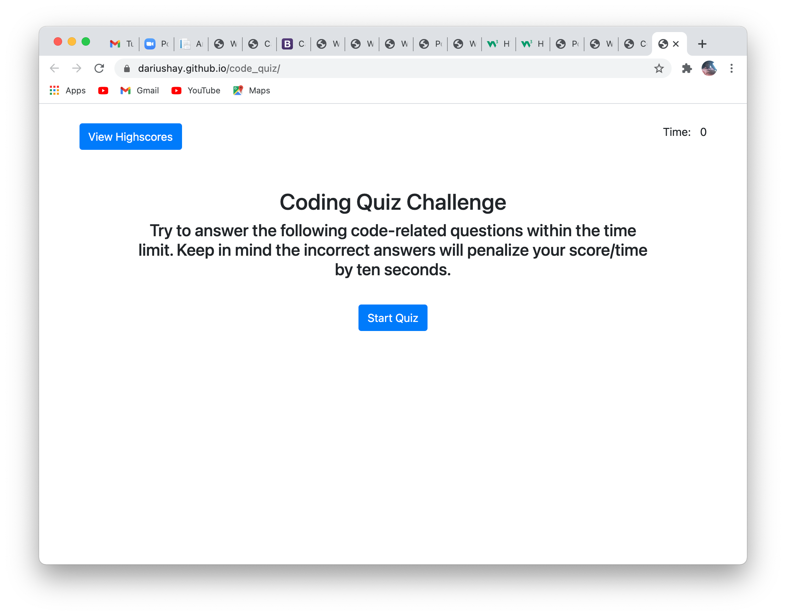
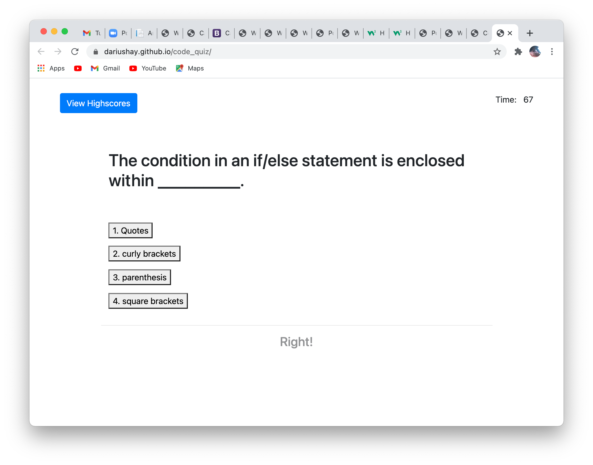
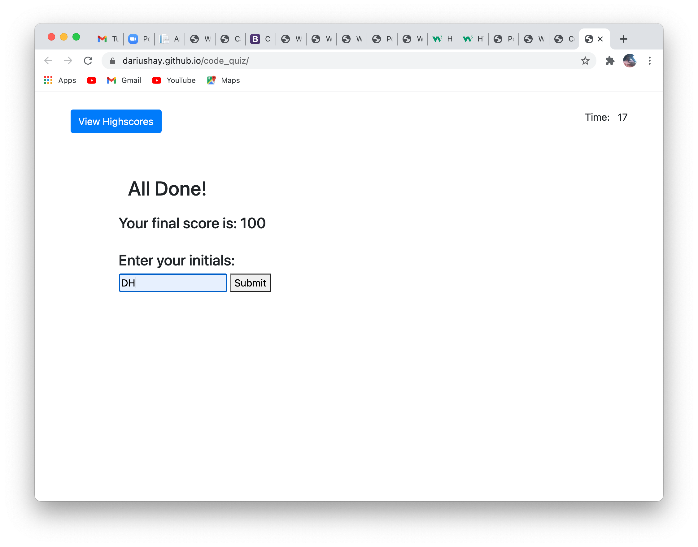
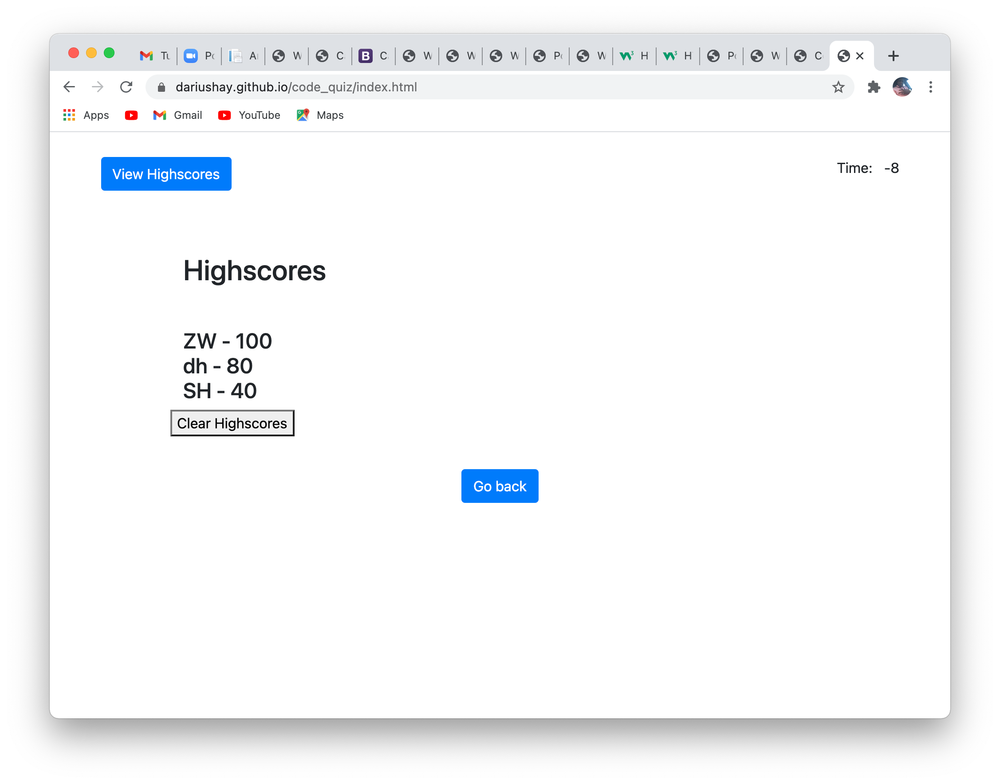

## Poject Title

Code Quiz

## Description

This is an application in which the user has 75 second to answer a series of 5 questions. Each question has an option of 4 answers to choose from. If the wrong answer is choosen, there is 15 seconds deducted from the timer. Each correct answer adds 20 points to your final score. If the timer gets to 0 the game ends and your score is based on the number of questions you answered corectly.

## Table of Content

1. [Installation requirements](#Installation)
2. [Screenshots](#Screenshots)
3. [Deployed](#Deployed)
4. [Contributions](#Contributions)
5. [Questions](#Questions)

## Installation

HTML, JavaScript, CSS, JQuery, Bootsrap, and LocalStorage was used to create this application.

## Deployed

https://dariushay.github.io/code_quiz/

## Contributions

Darius Hay https://github.com/DariusHay

## Screenshots

## Questions

If you have any additional questions about this project, you can find me on GitHub at DariusHay https://github.com/DariusHay, or you can email me at dariushay@gmail.com, thank you.
