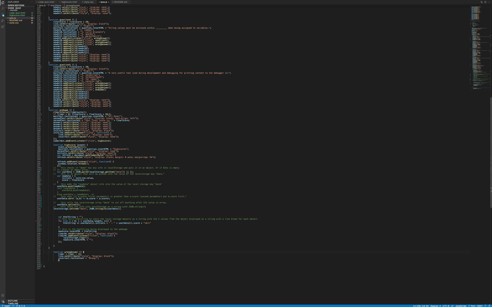

# code_quiz
In this project I created a coding quiz in which the user has 75 second to answer a series of 5 questions. Each question has an option of 4 answers to choose from. If the wrong answer is choosen, there is 15 seconds deducted from the timer. Each correct answer adds 20 points to your final score. If the timer gets to 0 the game ends and your score is based on the number of questions you answered corectly.

# Coding Languages
I used HTML, JavaScript, and CSS to create this application.

# URL 

# Screenshots

